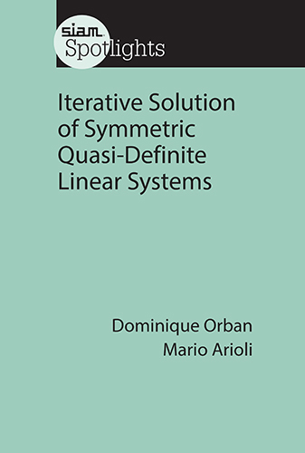

[SIAM](http://www.siam.org) just announced the publication of my book Iterative Solution of Symmetric Quasi-Definite Linear Systems in their *Spotlights* series, written with [Mario Arioli](https://www.researchgate.net/profile/Mario_Arioli).

The book is suitable for a graduate course on iterative methods for linear systems with applications to optimization and fluid dynamics.

We distribute software that implements the iterative methods discussed in the book in [Matlab](https://github.com/optimizers/Krylov.m), [Python](https://github.com/PythonOptimizers/pykrylov) and [Julia](https://github.com/JuliaSmoothOptimizers/Krylov.jl).

In 2015 I taught an accelerated graduate-level course at the university of Louvain-la-Neuve (Belgium) describing optimization methods that lead to quasi-definite linear systems.
The course material is available [here](https://sites.uclouvain.be/socn/Courses/Courses2014-4).

Head to the [SIAM Bookstore](http://bookstore.siam.org/sl03) to get your copy of the book!

Update: here is a list of
[errata](https://www.researchgate.net/project/Iterative-Solution-of-Symmetric-Quasi-Definite-Linear-Systems-SIAM-book/update/5a456f2bb53d2f0bba4776db).
